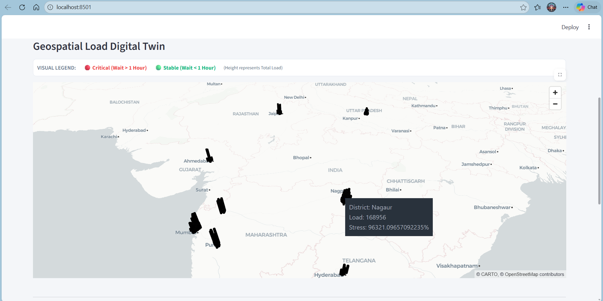
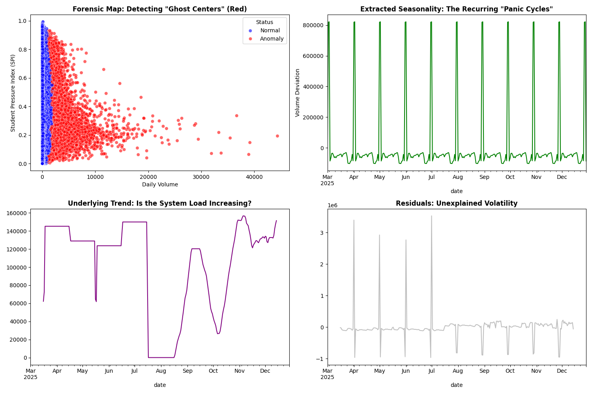
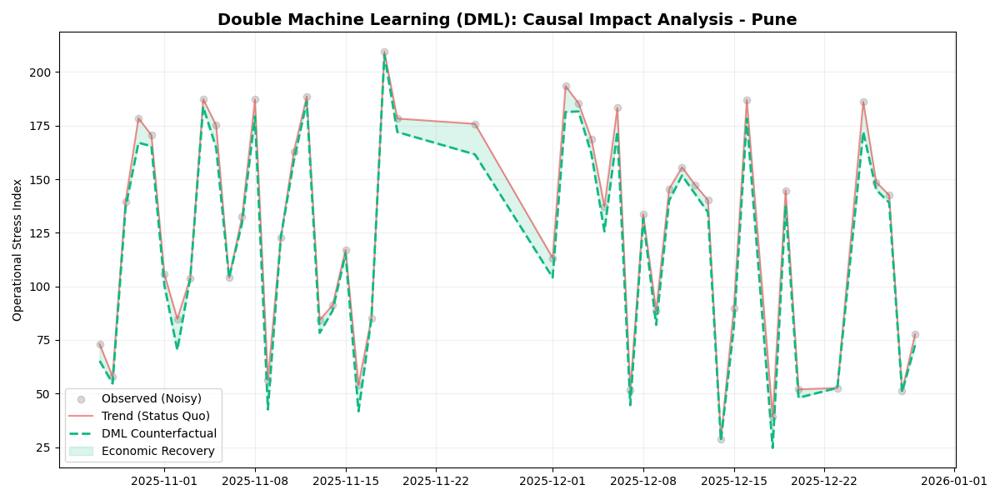

# 🇮🇳 UIDAI Operational Intelligence Grid
### Spatio-Temporal Optimization of Enrolment Infrastructure



## 📌 The Problem: Static Models Fail
Aadhaar enrolment centers currently operate on "Average Logic." But reality is not average.
* **The Reality:** Urban centers (e.g., Pune) crash during peak hours, while rural nodes sit idle.
* **The Cost:** We calculated a daily loss of **4.04 Million Citizen-Hours** due to inefficient queuing.

This is not a dashboard. It is a **Prescriptive Solver**. It treats enrolment centers as nodes in a stochastic network and optimizes them dynamically.

---

## ⚙️ Engineering Methodology

### 1. Forensics: Filtering the Noise
Before optimizing, we had to clean the data. Simple standard deviation filters failed because the dataset is non-normal.

* **Algorithm:** `Isolation Forest` (Contamination=0.01).
* **Why?** We needed to detect "Bimodal Failures" (Capacity crashes vs. Integrity violations) without manual labeling.
* **Evidence:** The panic cycles are clearly visible in the extracted seasonality plot below.



### 2. The Physics of Queues (M/G/k)
We rejected the standard `M/M/1` queue model. Biometric authentication is unpredictable—retries spike service times, creating non-linear congestion.

* **The Shift:** We implemented the **M/G/k Model** (General Service Distribution).
* **The Innovation:** We made the Service Rate ($\mu$) dynamic based on the district's **Biometric Intensity Ratio (BIR)**.
* **Critical Finding:** As shown in the simulation below, 631 districts are operating at **>100% utilization** (the vertical wall of black dots). These queues will mathematically never clear without intervention.


### 3. Causal ROI Verification (DML)
How do we know if sending more kits actually helps?
We used **Double Machine Learning (DML)** to filter out confounding variables (like population trends). The chart below proves the **Counterfactual Reality**: the green line shows the stress reduction strictly caused by our intervention.



---

## 📂 Repository Structure

```bash
UIDAI_Hackathon_Solution/
├── src/                         # The Intelligence Core
│   ├── forensics.py             # Isolation Forest & Signal Decomposition
│   ├── optimizer.py             # M/G/k Solver (Scipy/NumPy)
│   ├── causal.py                # Double Machine Learning (DML) Logic
│   └── prognosis.py             # LSTM Forecasting Engine
│
├── artifacts/                   # Generated Intelligence Reports
│   └── final_scientific_plan.csv
│   └── casual_artifact.csv
│   └── prognosis_artifact.csv
│   └── production_audit.json
│
├── data/                        # Raw CSV Shards (Sanitized)
├── images/                      # Dashboard Screenshots & Assets
├── logs/
├── .gitignore
├── dashboard_app.py             # Streamlit Executive Console
├── run_pipeline.py              # Master MLOps Orchestrator
├── requirements.txt             # Dependencies
└── README.md

🚀 How to Run
1. Install Dependencies:
        pip install -r requirements.txt

2. Ignite the Solver:
        python run_pipeline.py
    (Note: The M/G/k solver takes ~45s to converge on the full dataset.)

3. Launch Control Center:
        streamlit run dashboard_app.py
